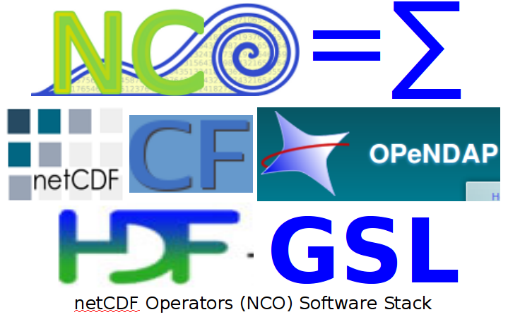

NCO NetCDF Operators
====================

The NCO toolkit manipulates and analyzes data stored in
[netCDF](http://www.unidata.ucar.edu/packages/netcdf)-accessible
formats, including 
[DAP](http://opendap.org),
[HDF4](http://hdfgroup.org/products/hdf4), and 
[HDF5](http://hdfgroup.org/HDF5).
It exploits the geophysical expressivity of many 
[CF](http://cfconventions.org/1.6.html) 
(Climate &amp; Forecast) metadata conventions, 
the flexible description of physical dimensions translated by
[UDUnits](http://www.unidata.ucar.edu/packages/udunits),
the network transparency of
[OPeNDAP](http://opendap.org), 
the storage features (e.g., compression, chunking, groups) of
[HDF](http://hdfgroup.org) (the Hierarchical Data Format),
and many powerful mathematical and statistical algorithms of 
[GSL](http://www.gnu.org/software/gsl) (the GNU Scientific Library).
NCO is 
[fast](http://dust.ess.uci.edu/ppr/ppr_ZeM07.pdf), 
[powerful](http://dust.ess.uci.edu/ppr/ppr_Zen08.pdf),
and 
[free](http://www.gnu.org/licenses/gpl-3.0.html).

What is NCO?
------------

The netCDF Operators (NCO) comprise a dozen standalone,
command-line programs that take 
[netCDF](http://www.unidata.ucar.edu/packages/netcdf),
[HDF](http://hdfgroup.org), and/or
[DAP](http://opendap.org)
files as input, then operate (e.g., derive new data, compute
statistics, print, hyperslab, manipulate metadata) and output the
results to screen or files in text, binary, or netCDF formats.
NCO aids analysis of gridded scientific data. The shell-command style
of NCO allows users to manipulate and analyze files interactively, or
with expressive scripts that avoid some overhead of higher-level
programming environments.   

Traditional geoscience data analysis requires users to work with
numerous flat (data in one level or namespace) files. 
In that paradigm instruments or models produce, and then repositories
archive and distribute, and then researchers request and analyze,
collections of flat files.
NCO works well with that paradigm, yet it also embodies the necessary
algorithms to transition geoscience data analysis from relying solely
on traditional (or &ldquo;flat&rdquo;) datasets to allowing newer
hierarchical (or &ldquo;nested&rdquo;) datasets.  

| Operator | Full Name                  | Examples
| -------- |:-------------------------- | :----------
| `ncap2` | netCDF Arithmetic Processor | [here](http://nco.sf.net/nco.html#ncap2) |
| `ncatted` | netCDF ATTribute EDitor   | [here](http://nco.sf.net/nco.html#ncatted) |
| `ncbo` | netCDF Binary Operator       | [here](http://nco.sf.net/nco.html#ncbo) |
| `ncclimo` | netCDF CLIMatOlogy Generator | [here](http://nco.sf.net/nco.html#ncclimo) |
| `nces` | netCDF Ensemble Statistics   | [here](http://nco.sf.net/nco.html#nces) |
| `ncecat` | netCDF Ensemble conCATenator | [here](http://nco.sf.net/nco.html#ncecat) |
| `ncflint` | netCDF FiLe INTerpolator  | [here](http://nco.sf.net/nco.html#ncflint) |
| `ncks` | netCDF Kitchen Sink          | [here](http://nco.sf.net/nco.html#ncks) |
| `ncpdq` | netCDF Permute Dimensions Quickly, Pack Data Quietly | [here](http://nco.sf.net/nco.html#ncpdq) |
| `ncra` | netCDF Record Averager       | [here](http://nco.sf.net/nco.html#ncra) |
| `ncrcat` | netCDF Record conCATenator | [here](http://nco.sf.net/nco.html#ncrcat) |
| `ncremap` | netCDF REMAPer          | [here](http://nco.sf.net/nco.html#ncremap) |
| `ncrename` | netCDF RENAMEer          | [here](http://nco.sf.net/nco.html#ncrename) |
| `ncwa` | netCDF Weighted Averager     | [here](http://nco.sf.net/nco.html#ncwa) |

### How to Contribute: Volunteer, Endorse, or Donate

The NCO project [homepage](http://sf.net/projects/nco)
points to mailing lists, discussion forums, and instructions to make
contributing easy. 

### Acknowledgements

NCO has been supported by volunteers and professionals since 1995. External support from DOE, NASA, and NSF has sustained development and addition of its most powerful features.
